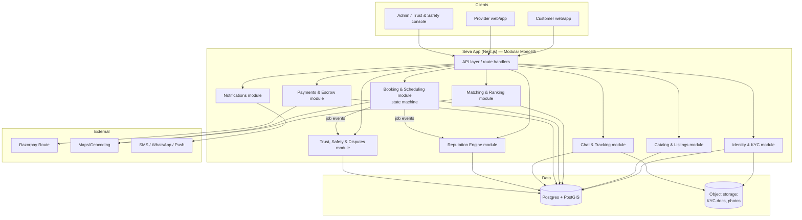
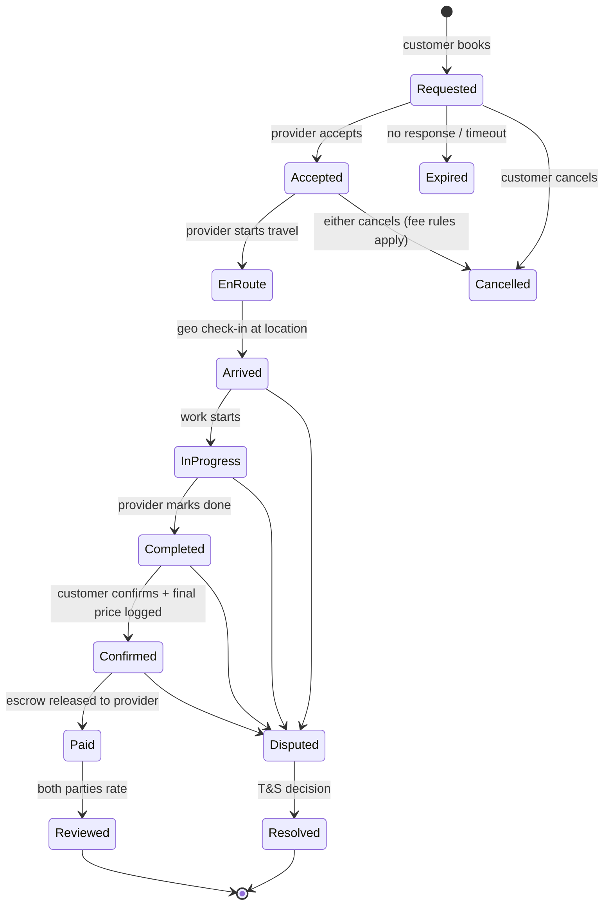
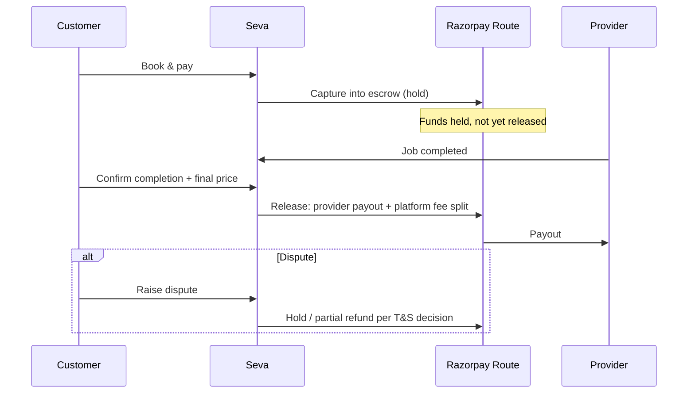

# Seva — System Architecture & Build Plan

*A local-services marketplace where individual providers carry portable, manipulation-resistant reputation.*

---

## 0. The one decision that shapes everything else

You keep using the word **"decentralized"** and referencing **Allora**. Before any code, separate two things that are easy to conflate:

- **The business model** you want is decentralized: a *store of individuals* (like the Play Store), not a company that employs workers (like Urban Company). ✅ Keep this. It's your identity.
- **The technology** does **not** need to be decentralized (no blockchain, no crypto, no on-chain reputation). Putting reputation on-chain would multiply your build time, cost, and complexity for zero user benefit at this stage.

**What to actually take from Allora is the *algorithm design*, not the infrastructure:**
- Reputation-weighted aggregation (a trusted rater counts more than a stranger).
- Merit-based ranking / "sortition" of who gets shown first.
- Explicit handling of **quality drift** — providers who start strong and decline, or start weak and improve.

So: **build a normal, centralized web app. Borrow Allora's math for your reputation engine.** That single reframing saves you months.

The second big principle: **your moat is not the app, it's the portable reputation + the fact that every transaction happens on-platform.** That means the hardest, most valuable work is the reputation engine and the trust/dispute layer — but those are *worthless until you have real transactions*. So the roadmap below deliberately builds the boring transactional core **first** and the clever reputation system **later**, once there's data to feed it.

---

## 1. Guiding principles

1. **Modular monolith, not microservices.** One codebase, one database, clean internal module boundaries. A solo/small team with zero users does not need distributed systems. You can extract a service later *if* a real bottleneck appears.
2. **Everything on-platform is the moat — and the enemy is disintermediation.** Customer meets a great cook via Seva, then next month pays her directly in cash to dodge the fee. Every marketplace dies from this. Defenses are baked into the design (see §7).
3. **Only *verified transactions* can be reviewed.** You can only rate a job you actually booked and paid for through Seva. This one rule kills ~90% of fake-review fraud at the source.
4. **Reputation is *derived*, never *authored*.** Store the raw facts (jobs, payments, ratings, timestamps, disputes). Compute reputation from them on a schedule. Never let anyone write a reputation number directly.
5. **Build for one city, a few categories, first.** Depth in Mumbai across 5 categories beats 50 cities × 20 categories with no liquidity. A marketplace with no nearby supply is useless.

---

## 2. Recommended tech stack (with reasoning)

You're moving from bolt.new (Vite + React) to Claude Code. Here's a stack that's fast to build, India-appropriate, and Claude Code works extremely well with.

| Layer | Choice | Why |
|---|---|---|
| **Frontend** | **Next.js (React)** | You already know React. Next.js adds SSR/SEO — essential so Google indexes "electrician in Andheri" pages, which is free customer acquisition. Reuse your bolt landing-page design. |
| **Backend + DB + Auth + Realtime + Storage** | **Supabase** (managed Postgres) | Collapses 5 services into one for MVP velocity: Postgres database, built-in auth (phone OTP — critical in India), realtime (for chat + live tracking), file storage (KYC docs, profile photos), row-level security. |
| **Geospatial** | **PostGIS** (Postgres extension, native in Supabase) | "Nearest available provider" is a geo query. PostGIS does radius/distance queries out of the box. No separate geo service needed for a long time. |
| **Payments + Escrow** | **Razorpay** (use **Razorpay Route** for marketplace split settlements) | India-domestic first-class: UPI, cards, wallets. Route lets you hold funds and split between provider and your platform fee — that's your escrow. Stripe is weak for India domestic. |
| **Maps / geocoding** | **Google Maps** or **Mapbox** | Address → lat/long, ETA, live tracking on the map. |
| **Notifications** | **MSG91 / Twilio** (SMS OTP), **WhatsApp Business API**, **FCM** (push) | In India, WhatsApp + SMS beat email for reach. Booking updates go here. |
| **Hosting** | **Vercel** (Next.js) + **Supabase cloud** | Zero-devops to start. |
| **Background jobs** | **Supabase cron / Edge Functions** early; a queue (e.g. **BullMQ**) later | Reputation recomputation, payout settlement, fraud scans run as scheduled jobs. |

You don't need Kubernetes, Kafka, Elasticsearch, or microservices for a long time. If you reach for them early, you're procrastinating with infrastructure.

---

## 3. High-level architecture



Each box is a **module (a folder) inside one app**, with a clear API and its own tables. They talk through function calls now; if one ever needs to scale independently, you lift it out into a service with minimal rewiring.

---

## 4. Core data model

The spine of the whole system is the **Booking (Job)** and its **state machine**. Tracking, payments, reviews, and disputes all hang off it.

### Key entities

- **User** — base account (phone-verified). A user can be a **Customer**, a **Provider**, or **both**.
- **ProviderProfile** — bio, KYC status, service areas (geo polygons/points + radius), availability schedule, categories offered.
- **ServiceCategory** — your taxonomy (Home Cleaning, Cook, Electrician…). Hierarchical.
- **Listing** — "this provider offers *this category* in *this area* at *this indicative price*."
- **Booking (Job)** — the transaction. Has a **status** (state machine below), scheduled time, location, price agreed, and the actual price charged.
- **PaymentTransaction** — escrow hold, release, refund, platform fee, provider payout. Mirrors Razorpay.
- **Review** — **bidirectional**: customer→provider *and* provider→customer. Multi-dimensional (see §6). Tied to a completed Booking — no booking, no review.
- **ReputationSnapshot** — the *computed* score for a user at a point in time, with its component breakdown. Recomputed by a job; never hand-edited.
- **Dispute** — raised by either side against a Booking, with evidence (chat, timestamps, photos) and a resolution.
- **Message** — chat, linked to a Booking.
- **FraudSignal / AuditEvent** — device fingerprints, velocity flags, admin actions.

### The Booking state machine (the heart of the system)



Every transition emits an **event** (timestamped). Those events are the raw material for *everything valuable*:
- Time from Accepted → Arrived = **punctuality / ETA reliability**.
- Requested → Accepted = **responsiveness**.
- Final price logged at Confirmed = **price transparency** (surface "typical charge for this job" on the provider's public page).
- Cancellations, disputes, no-shows = **negative reputation signals**.

Because you capture the actual charged price on-platform, you get transparent per-job pricing for free — exactly what you described.

---

## 5. Matching & Ranking engine (the "Uber-like" part)

When a customer requests category **C** at location **L** for time **T**:

**Step 1 — Filter (hard constraints).** Candidates must: offer C, cover L within their service radius (PostGIS `ST_DWithin`), be available at T, be KYC-verified, and not be blocked/suspended.

**Step 2 — Score & rank (soft ranking).** Each candidate gets a score combining:

```
match_score =
     w1 · proximity_score          (closer / lower ETA = better)
   + w2 · reputation_score         (from §6)
   + w3 · availability_score       (can take it now / soon)
   + w4 · price_fit_score          (matches customer's budget band)
   + w5 · acceptance_likelihood    (historically accepts these jobs)
   + w6 · exploration_bonus        (see below)
```

Show providers in descending `match_score`. Tune the weights with real data later; start with reputation and proximity dominant.

**Step 3 — The newcomer problem (this is your Allora insight).** If you always rank by reputation, new good providers can *never* get a first job, so they can never build a record → rich-get-richer, supply starves. Fix with **exploration**: reserve a slice of visibility (an `exploration_bonus`, à la epsilon-greedy / Thompson sampling) for promising newcomers, and give them a temporary "New" trust treatment (extra escrow protection, closer monitoring). This is the direct analog of how Allora lets new inference workers earn their way in.

**Two-sided ranking.** Providers also see *incoming requests ranked by customer reputation* — a long-tenured, on-time-paying, well-mannered customer surfaces first. Same engine, mirrored.

---

## 5.5 Bargaining & Negotiation — *structured*, not free-for-all

**Verdict: yes, but with guardrails.** Bargaining is culturally real, and for *unstandardized* jobs (painting, deep cleaning, furniture repair, events) the price is genuinely negotiable anyway — so it fits. The counter-current to respect: Uber/Ola largely *won* by *removing* haggling, and your core segment (relocated professionals in a hurry) often moved to apps precisely to escape it. So the design goal is to capture the emotional *"I won a deal"* satisfaction **without** adding friction for the hurried, leaking users off-platform, or grinding providers into a race to the bottom.

Four decisions make that work:

**1. Optional, not mandatory — instant book stays the fast path.**
Default CTA is **"Book at ₹X"** (one tap, Uber-speed). **"Make an offer"** sits beside it for those who want to haggle. The hurried engineer is never forced to negotiate; the deal-lover gets their game.

**2. Category-aware — `pricing_mode` per listing.**
- **Fixed** — small, standardized, urgent (visit fee, AC gas refill). No haggling; these buyers want speed.
- **Negotiable** — most home services, within a bounded range.
- **Quote-on-request (RFQ)** — large one-offs (painting, renovation, events): customer posts the job, nearby providers submit competing quotes, customer picks. Bargaining-as-competition; produces a "great deal" feeling naturally.

**3. Structured offers, NOT free-text haggling.**
Negotiation runs through **offer / counter / accept buttons**, never open chat. This is critical for three reasons: it's auditable, the agreed price flows cleanly into your transparency + escrow data, and — most importantly — **free-text price-talk is exactly where "let's just settle in cash directly" happens.** Structured offers close that leakage channel.

**4. Bounded + async via a hidden floor.**
Provider pre-sets (privately): `list_price`, a hidden `floor_price`, and an `auto_accept_threshold`. Customer sends an offer:
- **above threshold →** auto-accepted instantly ("Offer accepted — you saved ₹X!") — dopamine hit, no waiting, provider needn't be online.
- **between floor and threshold →** provider is notified to accept/counter (max 2–3 rounds, each offer expires).
- **below floor →** auto-declined with a polite nudge ("try ₹Y"), so providers are never insulted or ground below their dignity line.

The platform also enforces a **hard floor** (e.g. can't drop below X% of list) to **protect provider earnings** — letting customers grind providers down every job is the fastest way to lose good supply.

### Data model deltas
- **Listing** gains: `pricing_mode` (fixed | negotiable | rfq), `list_price`, `floor_price` (private), `auto_accept_threshold`, `max_counter_rounds`.
- New **Offer** entity: a short, bounded sequence attached to a pending booking — `initiator`, `amount`, `round`, `status` (pending/accepted/countered/declined/expired), `expires_at`.
- New **QuoteRequest** + **Quote** entities for RFQ mode.
- **Booking.price_agreed** now comes from the accepted Offer/Quote and **locks before work starts.**

### State machine delta
Insert a bounded **Negotiating** phase at the front:

```
Requested → Negotiating (offer/counter loop, capped rounds + expiry) → Accepted (price LOCKED) → EnRoute → …
```

An accepted auto-offer passes through Negotiating in a single step. Everything after Accepted is unchanged.

### Ties into the rest of the system
- **Reputation as negotiating power** (a fresh reason to earn reputation): high-reputation, long-tenured customers get *better* auto-accept thresholds and provider-initiated special offers; providers can proactively "send a special price" to great customers. Two-sided bargaining — and it makes reputation more valuable.
- **Price transparency improves, not breaks:** the public page shows a *range* — "typically ₹X–₹Y, negotiable" — which is more honest than a single fixed number.
- **New fraud signals for §7:** bait-and-switch (agreed low, then charges much higher at arrival with no scope change — caught by comparing agreed price vs the actual charged price logged at Confirmed); lowball-spam customers (a flood of insulting offers → reputation signal); repeated attempts to push negotiation into free-text / contact exchange → leakage flag.

---

## 6. Reputation Engine (your core differentiator)

This is where you spend your best thinking. Design goals: **manipulation-resistant, time-aware, and merit-weighted.**

### 6.1 Multi-dimensional, not one star
Collect ratings on separate axes so the signal is rich and harder to game:
- **Quality** of work
- **Punctuality** (partly auto-measured from state-machine timestamps, not just self-report)
- **Price fairness / transparency**
- **Communication / conduct**

Auto-measured signals (punctuality, completion rate, response time, dispute rate) are **more trustworthy than self-reported stars** because they come from system events, not opinions. Weight them heavily.

### 6.2 The four mechanisms that make it fair

**(a) Bayesian shrinkage — stops small-sample gaming.**
A provider with one 5★ should *not* outrank one with 200 jobs at 4.8★. Shrink each score toward a global prior until there's enough evidence:

```
adjusted = (C · m + Σ ratings) / (C + n)
   m = global average rating (the prior)
   C = confidence constant (e.g. 10 "virtual" average ratings)
   n = number of real ratings
```

**(b) Time decay — captures quality drift (the Allora scenario).**
Recent behavior matters more than a year-old glow or an old mistake. Weight each rating by exponential decay:

```
weight_time = exp(−λ · age_in_days)
```

This automatically handles "was great, now sloppy" *and* "was shaky, now excellent" without any special-casing.

**(c) Rater weighting — your "established users count more" idea.**
A review from a long-tenured, honest, high-reputation customer carries more weight than one from a day-old account:

```
weight_rater = f(rater tenure, rater reputation, rater's own dispute history)
```

⚠️ **Bound this.** If rater weight is unbounded it (i) entrenches incumbents and (ii) becomes circular (reputation deciding reputation). Cap it to a sane range (e.g. 0.5×–2×) so no single actor can dominate, and never let a brand-new account's reviews count for much until it has real history.

**(d) Verified-transaction gate — the big one.**
No review exists without a completed, paid on-platform booking behind it. This alone defeats most fake reviews, because faking a review now requires faking a whole paid transaction (which costs real money and leaves a trail).

### 6.3 Putting it together
For each rating, combined weight = `weight_time × weight_rater`. The provider's score per dimension is the weighted, Bayesian-shrunk average, then blended with the auto-measured operational metrics (completion %, on-time %, dispute rate, tenure). Recompute on a schedule (e.g. nightly + on each new job event) and store as a **ReputationSnapshot** so you keep history and can explain *why* a score is what it is.

### 6.4 Incentives to actually leave reviews
Reviews are the fuel; low review rates starve the engine. Motivate them:
- **Reputation itself is the incentive** — you only build your customer reputation (which gets you priority + better providers) by completing and reviewing jobs on-platform.
- Small **wallet credits / cashback** for a review within 24h of completion.
- **Reciprocity nudge**: both sides' reviews are revealed only after *both* submit (or a deadline passes) — prevents retaliation bias and boosts completion.
- **Streaks / tiers**: Silver/Gold/Platinum for consistent, honest activity (you already sketched this in your UI).

---

## 7. Trust, Safety & the disintermediation problem

### 7.1 Fraud & abuse defenses
- **KYC**: phone OTP for everyone; ID/Aadhaar-based eKYC + (for high-trust categories like childcare and elderly care) **background checks**.
- **Verified-transaction-only reviews** (again — it's that important).
- **Anomaly detection** (a scheduled job): rating spikes, review bursts, coordinated clusters by device fingerprint / IP / payment instrument, text similarity in reviews (review rings), providers and customers who *only* ever interact with each other.
- **Velocity limits**: caps on new-account actions.
- **Reputation-attack protection**: because a review requires a real paid booking, a competitor can't cheaply tank a rival — and rater-weighting means a swarm of fresh accounts barely moves the needle.

### 7.2 Disputes
Either side opens a **Dispute** on a Booking. Because everything ran on-platform, you already hold the evidence: chat logs, state timestamps, geo check-ins, before/after photos, the agreed vs charged price. Trust & Safety (admin console) reviews and resolves; the outcome feeds back into both reputations. **Escrow is what gives disputes teeth** — funds are held until resolution.

### 7.3 Disintermediation (the existential risk)
People *will* try to take repeat business off-platform to skip fees. You can't fully prevent it, but you make on-platform clearly better:
- **Escrow + money-back guarantee** — off-platform, the customer has no protection.
- **Reputation only accrues on-platform** — a provider who goes off-platform stops building the reputation that feeds them new customers. That's the strongest lock-in.
- **Convenience** — scheduling, reminders, one-tap rebooking, saved payment.
- **Subscriptions** for high-frequency needs (daily cook/cleaning): a flat monthly platform fee removes the per-transaction incentive to defect.
- Watch for the tell (contact exchanged in chat, then bookings stop) as a fraud signal.

---

## 8. Payments & escrow flow



Escrow protects both sides and is the backbone of your service guarantee.

---

## 9. Build roadmap — what to build with Claude Code, in order

Build **top to bottom**. Don't start a phase before the one above is real.

### Phase 0 — Foundation (week 1–2)
Next.js app + Supabase (Postgres/PostGIS/Auth/Storage). Phone-OTP auth. User + ProviderProfile + ServiceCategory tables. Port your bolt landing page. **One city, 3–5 categories.**

### Phase 1 — Make one real transaction possible (the MVP that matters)
Listings → basic search/filter by category + location (PostGIS radius) → the **Booking state machine** end to end → in-app chat → basic notifications. **Goal: a real customer books a real provider and the job completes.** No payments yet (cash offline is fine to start), no fancy reputation.

### Phase 2 — Close the loop with money & trust
Razorpay Route escrow → bidirectional multi-dimensional reviews (verified-transaction-gated) → a **simple** reputation score (plain weighted average + completion/on-time %) → dispute flow + admin console → KYC → **structured bargaining v1** (§5.5: `pricing_mode`, offer/counter/auto-accept with hidden floor). Bargaining belongs here because the agreed price must lock into escrow.

### Phase 3 — The clever layer (only now)
Full reputation engine (Bayesian + time decay + rater weighting) → the weighted matching/ranking engine with exploration for newcomers → fraud/anomaly detection jobs (incl. bait-pricing + lowball-spam signals) → **RFQ/competing-quotes mode + reputation-linked negotiating power** → tiers, incentives, subscriptions → live tracking on map.

### Phase 4 — Scale
More cities/categories, SEO landing pages per category×area, WhatsApp automation, background-job queue, observability, then extract any hot module into its own service **only if metrics demand it.**

---

## 10. What to deliberately NOT build yet

- ❌ Blockchain / on-chain reputation — no user value now, huge cost.
- ❌ Microservices — a modular monolith is faster and enough.
- ❌ ML fraud/ranking models — start with rules + simple weighted scores; you have no data to train on yet anyway.
- ❌ Native mobile apps — responsive web (or a PWA) first; go native once retention justifies it.
- ❌ 50 cities / 20 categories at launch — you need *local liquidity*, so go deep in one place.

**The recurring theme:** the sophisticated pieces (reputation math, ranking, fraud ML) are your long-term moat, but they are *powered by transaction data you don't have yet*. Earn the data first with a dead-simple transactional core, then layer the intelligence on top. That sequencing is the single biggest thing that separates marketplaces that ship from ones that stall.
